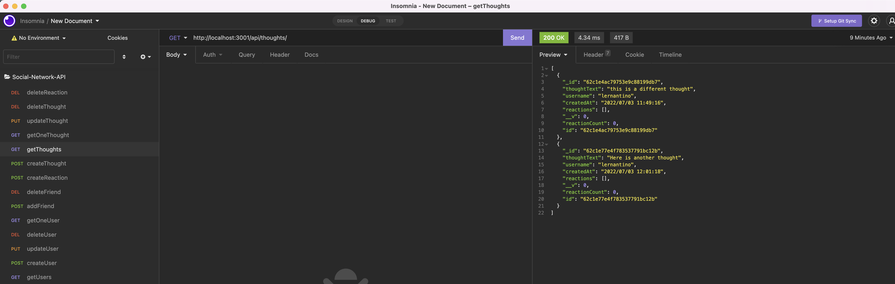

# Social Network API - MongoDB

## Tabel of Countents

- [Description](#description)
- [Installation](#installation)
- [Usage](#usage)
- [Contributing](#contributing)
- [Tests](#tests)
- [License](#license)
- [Questions](#questions)

## Description

This is a back end application for a social network using MongoDB as the database program. It includes users and thoughts. Users can have friends and they can react to other user's thoughts.

To see a walkthrough video of the application, follow this [link](https://youtu.be/u5EVZ0XBlO8).

## Installation

To install, clone the repository locally. Then in the command line, navigate to the cloned directory and run "npm start". This will start the server. Then use Insomia to use the routes, creating updating and deleting the users and thoughts on your local machine.

## Usage

The use case for the project is to arrange a document-oriented database structure that serves as a simple social network back end.

## Contributing

To contribute, follow the installation instructions above and create a new branch to work on changes. Then when your changes are complete and the application functions as it should, request a PR and your code will be reviewed before being merged into the main branch.

## Tests

There are no tests for the application.

## License

    MIT

## Questions

- [GitHub profile](https://github.com/millersg47)
- Contact Me at millersg47@gmail.com with additional questions
